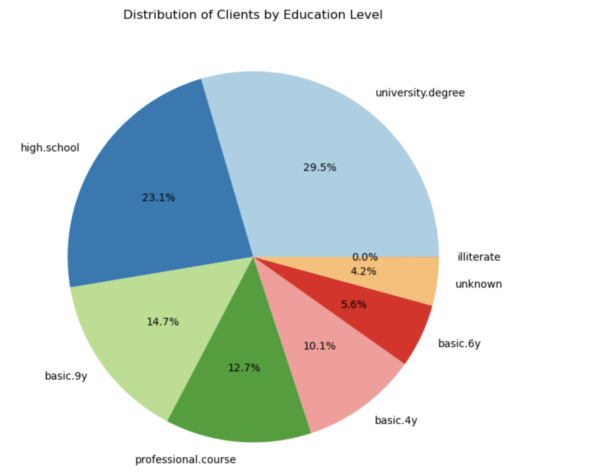
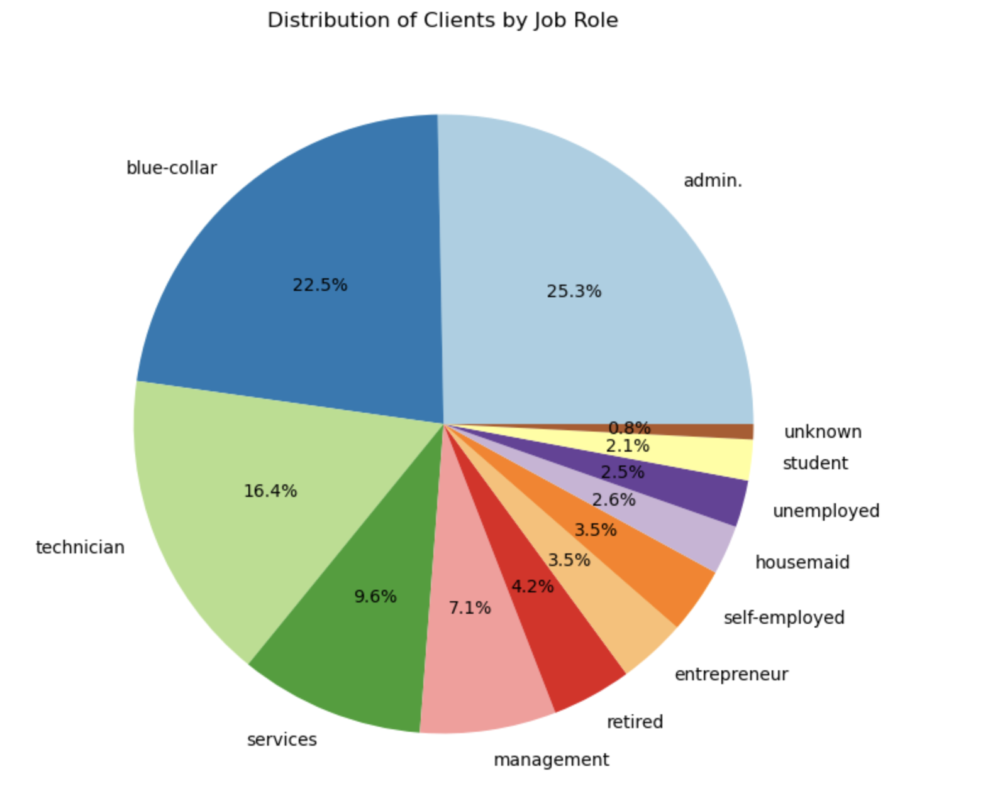

# Bank_Marketing_Prediction

## Introduction
This project contains exploration of different classification models for predicting whether a customer accepts a bank offer or not for data in here [Bank Data](data/bank-additional.csv)

## Data Visualizations

## Data Processing

Used the OrdinalEncoder and LabelEncoder for encoding the categorical features

## Models Performance

